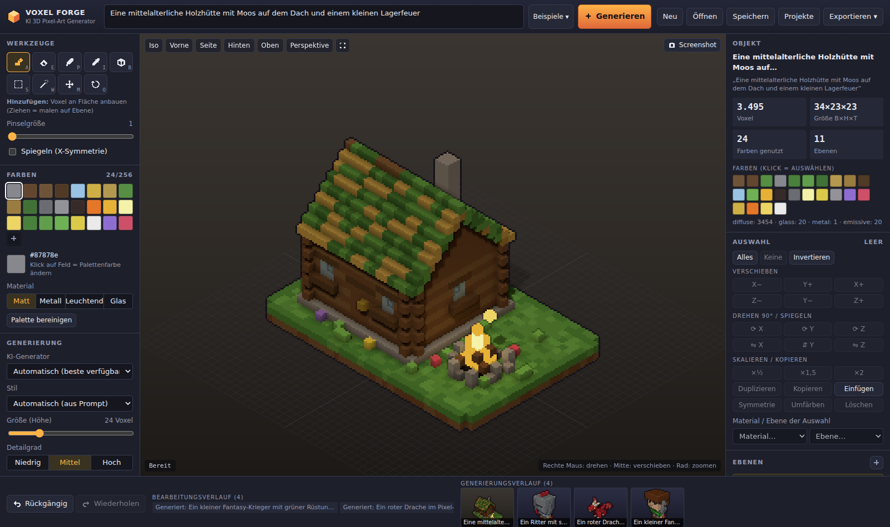

# Voxel Forge – KI Game-Asset-Generator (2D Pixel-Art + 3D Voxel)

Voxel Forge erzeugt aus Textbeschreibungen **komplett editierbare Spiel-Assets**: 2D-Pixel-Art-Sprites inkl. Animationen und Sprite-Sheets, Karten-Tilesets, Effekte, UI-Kits und **3D-Voxelmodelle** – mit einheitlichem Projekt-Stil (Style Lock) und direktem **Godot-Export**. Eine Mischung aus Aseprite, MagicaVoxel, einem vereinfachten Blender, einem KI-Bildgenerator und einer Asset-Pipeline für Solo-Entwickler.

> „Ein kleiner Fantasy-Krieger mit grüner Rüstung, Schwert und Umhang im Stil eines alten JRPGs“
> „Eine mittelalterliche Holzhütte mit Moos auf dem Dach und einem kleinen Lagerfeuer“



Das Ergebnis ist kein Bild, sondern eine Voxel-Struktur (Position, Palettenfarbe, Material, Leuchtstärke, Ebene je Voxel), die sich voxelgenau bearbeiten, animieren und in gängige Formate exportieren lässt.

---

## Schnellstart

```bash
npm install
npm run dev          # Frontend (http://localhost:5173) + Backend (http://localhost:8787)
```

Beim ersten Start wird automatisch ein Beispielmodell generiert. Prompt eingeben → **Generieren** (oder Enter).

| Befehl | Zweck |
|---|---|
| `npm run dev` | Frontend (Vite) und Backend (Express, Auto-Reload) gemeinsam |
| `npm run dev:client` | Nur Frontend – Generierung läuft dann komplett im Browser |
| `npm run build && npm start` | Produktionsbuild; das Backend liefert `dist/` mit aus |
| `npm test` | Unit-Tests (Datenstruktur, Transformationen, Generator, Formate, Animationen) |
| `npm run typecheck` | TypeScript-Prüfung (Frontend, Backend, Tests) |
| `npm run generate -- "Ein roter Drache" 32` | 3D-Generierung auf der Kommandozeile (`--save` speichert ein Projekt) |
| `npm run sprite -- "Ein Waldläufer mit Bogen" 32 out` | 2D-Sprite-Sheet + `metadata.json` + Godot-`.tres` auf der Kommandozeile (optional 4. Argument: Stilbeschreibung) |

Voraussetzung: Node.js ≥ 20.

---

## Funktionen

Die Oberfläche hat vier Arbeitsbereiche: **2D Pixel-Art**, **3D Voxel**, **Bibliothek** und **Stil & Referenzen**. Oben steht immer das Prompt-Feld mit Ausgabe-Wahl (automatisch, 2D-Sprite, 3D-Voxel, Tileset, Effekt, UI). „Automatisch“ erkennt Kategorie und Absicht aus dem Text – z.B. „Erstelle eine Angriff-Animation für diesen Charakter“ fügt dem geöffneten Sprite eine Animation hinzu, statt ein neues Asset zu bauen.

### 2D-Pixel-Generator
- **Echte Pixelgrafik:** indizierte Bilder (Palettenindex je Pixel), transparenter Hintergrund, feste Auflösung (16 = Gameboy, 32 = klassisches RPG, 64 = detailliert, 128 = moderner Indie oder frei wählbar), begrenzte Palette
- **Technik:** Text → Voxelmodell in Sprite-Auflösung → deterministischer Pixel-Rasterizer (orthografischer Raycast, stufige Beleuchtung mit Farbrampen und Hue-Shifting, Schlagschatten, Innenlinien, 1-px-Kontur, Glas durchscheinend). Ansichten: vorne, seitlich, Top-down (RPG), isometrisch; 1/2/4/8 Richtungen
- **Kategorien:** Charaktere (Spieler, NPC, Gegner, Monster, Tiere, Bosse), Items (Schwerter, Äxte, Bögen, Schilde, Rüstung, Helme, Stäbe, Tränke, Werkzeuge, Questitems), Gebäude & Einrichtung (Häuser, Burgen, Türme, Ruinen, Möbel, Türen, Deko), Umgebung (Bäume, Pflanzen, Felsen, Wasser, Berge, Höhlen, Wege, Brücken)
- **Karten-Tiles:** Biome (Wald, Wiese, Wüste, Winter, Küste, Sumpf, Dungeon, Stadt, Vulkan) mit Grund-Tiles, **Wang-Übergängen** (16 je Terrainpaar), Deko-Objekten und animierten Tiles (Wasser, Lava); 16/32/64/frei
- **Effekte** (Feuer, Feuerball, Eis, Blitz, Heilung, Gift, Explosion, Rauch, Magie, Schwerthieb, Wasser, Schild, dunkle Magie) und **UI-Kits** (9-Slice-Panel, Buttons, Leisten, Herzen, Münzen, Icons)
- **Pixel-Editor (Aseprite-ähnlich):** Stift, Radierer, Füllen, Pipette, Linie, Rechteck, Frame verschieben, Frame spiegeln, Pinselgröße, X-Spiegelung beim Zeichnen, Onion-Skin, Raster, Zoom/Pan, Undo/Redo, Palette bearbeiten, Frames hinzufügen/duplizieren/löschen, Live-Vorschau

### Sprite-Sheets & Animationen
- **Charakter-Animationen:** Idle (Stehen, Atmen, leichte Bewegung), Laufen, Rennen, Schleichen, Springen, Angriff, Blocken, Ausweichen, Zaubern, Treffer, Tod, Sieg, Interagieren; dazu Vierbeiner, Flieger und Schleime
- **Objekt-Animationen:** Tür öffnen, Truhe öffnen, Feuer/Fackel, Wasserbewegung, Windmühle/Maschinen, Wind in Bäumen, Rauch, schwebende/rotierende Items
- **Frei einstellbar:** Frames, FPS, Größe, Richtungen, Loop. Posen sind Funktionen der Zeit – jede Frame-Anzahl funktioniert
- **Animation für bestehenden Charakter:** neue Animationen werden aus demselben Quellmodell mit identischer Rahmung, Pixelgröße und **exakt derselben Palette** gerendert – Farben, Kleidung, Körperform und Fußlinie bleiben unverändert
- **Metadaten** (`metadata.json`): Frame-Größe, Anzahl, Animationsname, Richtung, Geschwindigkeit, Loop, Position jedes Frames im Sheet

### Stilprofile, Style Lock & Referenzen
- **Art-Style-Profil** je Projekt: Palette (gesperrt/max. Farben), Sättigung, Helligkeit, Farbstimmung, Schatten-/Lichttöne, Pixelgrößen (Charakter/Tile/Item), Kontur (schwarz/dunkel/farbig/keine), Schattierungsstufen, Lichtrichtung, Proportionen (Chibi/JRPG/heroisch), Ansicht, Richtungen, Detailgrad. Vorlagen (Fantasy RPG, Retro Gameboy, Cute Pixel, Dark Fantasy, Sci-Fi, Indie 128) oder **per Text beschreiben** („32x32, dunkle Fantasy, 4 Richtungen, schwarze Outline …“ – mit Claude oder lokal geparst)
- **Style Lock:** jedes neue Asset (2D und 3D) übernimmt automatisch Pixelgröße, Palette, Kontur, Perspektive, Licht und Detailgrad – ein später erzeugter Magier passt zum ersten Ritter
- **Palette aus der Bibliothek lernen:** bestehende Assets analysieren und gemeinsame Projektpalette ableiten
- **Referenzsystem:** eigene Bilder hochladen → Analyse von Palette, Pixel-Skalierung, Kontur, Schattierungsstufen, Lichtrichtung, Sättigung → ins Profil übernehmen („Erstelle einen Bogenschützen im gleichen Stil“) oder direkt als editierbares Sprite importieren

### Projektbibliothek
- **Keine vorgefertigte Asset-Datenbank:** die Bibliothek startet leer und enthält nur Assets, die im Projekt generiert oder gezeichnet wurden – plus Stilprofile, Prompts, Paletten und Metadaten
- Filter nach Kategorie, Suche, Umbenennen, Duplizieren, Öffnen im passenden Editor
- Autosave im Browser (IndexedDB), Datei-Export/-Import (`.game.json`), Speichern auf dem Server
- Generierung läuft in einem Web Worker – die Oberfläche bleibt bedienbar

### Godot-Export
- **2D:** PNG-Sprite-Sheet (indiziert, transparent), Einzelframes, `SpriteFrames`-Ressource (`.tres`, alle Animationen wie idle, walk, attack, hurt, death je Richtung), `metadata.json`; Tilesets als `TileSet`-`.tres` mit Terrain-Peering-Bits (Autotiling) und animierten Tiles
- **3D:** GLTF/GLB, OBJ, eigenes Voxelformat
- **Ordnerstruktur:** `res://assets/{characters, weapons, items, buildings, environment, tiles, effects, ui}/<name>/` – z.B. `res://assets/characters/ranger/{ranger.png, ranger.tres, metadata.json}`. Einzelnes Asset oder das ganze Projekt als ZIP (inkl. Palette `.gpl` und Stilprofil)

### Text → 3D-Voxelmodell
- **Eingaben:** Beschreibung, Stil (oder automatisch aus dem Prompt), Größe (12–64 Voxel Höhe), Farbpalette, Detailgrad, optionaler Seed (reproduzierbar)
- **Prompt-Analyse (DE/EN):** erkennt Objekte, Varianten, Ausrüstung, Merkmale, Farben inkl. Zuordnung („grüne Rüstung“, „roter Drache mit goldenen Hörnern“), Größen, Mengen („drei Bäume“, „Wald“), Platzierung („links“, „davor“), Tageszeit und Untergrund
- **Objektbibliothek:** Figuren (Krieger, Ritter, Magier, Hexe, Elf, Zwerg, König, Engel, Dämon, Skelett, Roboter, Ork …), Drachen, 13 Tierarten, Vögel/Phönix, Schleime, Häuser/Hütten, Türme, Burgen, Bäume (8 Varianten), Lagerfeuer, Truhen, Pilze, Kristalle, Felsen, Waffen, Tränke, Raumschiffe – plus **freie Primitive** für alles andere (über LLM)
- **Szenen:** mehrere Objekte werden überlappungsfrei platziert, optional auf einem Diorama-Sockel mit Gras und Blumen
- **Ebenen mit Rollen** (z. B. `leg_left`, `weapon`, `flame`) – Grundlage für Animationen

### Editor (MagicaVoxel-ähnlich)
| Werkzeug | Taste | Funktion |
|---|---|---|
| Hinzufügen | `A` | Voxel an Flächen anbauen, Ziehen malt auf der Ebene |
| Löschen | `E` | Voxel entfernen |
| Malen | `P` | Voxel umfärben (Farbe + Material) |
| Pipette | `I` | Farbe, Material und Ebene aufnehmen |
| Box | `B` | Quader aufziehen (`Shift` = Höhe, `Strg` = Box löschen) |
| Auswahl | `S` | Klick / Rechteck (`Shift` hinzufügen, `Strg` entfernen) |
| Zauberstab | `W` | Zusammenhängende Farbe (`Strg` = Farbe global) |
| Verschieben | `M` | Auswahl ziehen (`Shift` = vertikal) |
| Kamera | `O` | Linke Maus dreht die Kamera |

Weitere Funktionen: Pinselgröße, X-Spiegelsymmetrie (`X`), Auswahl verschieben (Pfeiltasten, `Bild↑/↓`), drehen (`R`, Panel), spiegeln, skalieren (×½, ×1,5, ×2, Nearest-Neighbor), duplizieren (`Strg+D`), kopieren/ausschneiden/einfügen, symmetrisch kopieren, umfärben, Material/Ebene zuweisen, Ebenen (sichtbar, gesperrt, umbenennen, löschen), Palette bearbeiten (ändert alle Voxel einer Farbe), **Undo/Redo** (`Strg+Z` / `Strg+Y`, 200 Schritte).

Kamera: rechte Maus drehen, mittlere Maus verschieben, Mausrad zoomen. Ansichten `1` Isometrisch · `2` Vorne · `3` Seite · `4` Hinten · `5` Oben · `F` einpassen; Perspektive/Orthografisch umschaltbar.

### Pixel-Art-Rendering
- Rendern in reduzierter Auflösung mit Nearest-Neighbor-Hochskalierung (einstellbare Pixelgröße)
- Konturen (außen) und abgedunkelte Innenkanten, Posterize, 4-Farben-Palette (Game Boy)
- Voxel-Ambient-Occlusion, harte Schatten, Himmels-/Bodenlicht, farbige Punktlichter an leuchtenden Voxeln (Feuer, Fenster, Kristalle)
- Stil-Presets: **Fantasy RPG, Sci-Fi, Medieval, Dark Fantasy, Cute Pixel, Retro Gameboy** – beeinflussen Farben, Palettengröße und Rendering
- Paletten: Stil (automatisch begrenzt), PICO-8, Sweetie 16, Endesga 32, Game Boy, frei

### Animationen
Animationen werden als **Veränderungen der Voxel-Struktur** gespeichert (pro Frame: gesetzte und entfernte Voxel relativ zum Basismodell). Automatisch erzeugt werden je nach Objekt: Idle/Atmen, Laufen, Angriff (Waffenschwung), Fliegen (Flügelschlag), Flackern (Feuer), Hüpfen, Wind, Fahne, Rauch, Schweben und Drehen. Wiedergabe, Frame-Scrubbing und Geschwindigkeit im rechten Panel; nach Bearbeitungen „Neu berechnen“.

### Speichern & Export
| Format | Inhalt |
|---|---|
| **Projekt `.voxproj.json`** | komplett editierbar: Voxel, Palette, Ebenen, Animationen, Prompt, Blueprint, Seed, Editor-Einstellungen |
| **PNG** | Pixel-Art-Rendering bis 2048², optional transparent und eingepasst |
| **Sprite Sheet** | PNG + JSON-Atlas, Zeilen = 1/4/8 Blickrichtungen, Spalten = Animationsframes |
| **GLB/GLTF** | Vertex-Farben, getrennte Materialien (matt/metall/leuchtend/glas) |
| **OBJ + MTL** | Vertex-Farben + Materialgruppen pro Palettenfarbe, Quads |
| **MagicaVoxel `.vox`** | Voxel + Palette (≤ 256³) |

Import: `.voxproj.json`, `.vox`, `.obj` (wird voxelisiert), Bilder `.png/.jpg` (Sprite wird zu 3D „aufgeblasen“). Zusätzlich: Autosave im Browser, Generierungsverlauf mit Vorschaubildern, Projektablage auf dem Server („Projekte“).

---

## Architektur

```
src/
  shared/                      ← läuft im Browser UND im Node-Backend (keine DOM-Abhängigkeiten)
    voxel/        VoxelModel (Datenstruktur, Undo-Aufzeichnung), Transformationen
    palette/      Farben, Stil-Presets, Paletten
    ai/
      types.ts    GenerationRequest, SceneBlueprint, PromptInterpreter, VoxelGenerator
      generators.ts  BlueprintGenerator, GeneratorRegistry, Blueprint-Validierung
      interpreter/   Regelbasierte Prompt-Analyse + Wortschatz (DE/EN)
      procedural/    Sculptor (Zeichenwerkzeuge), Objektbibliothek, SceneBuilder
    animation/    Frames als Voxel-Diffs, Posen-Bibliothek (Charaktere, Tiere, Objekte, Items)
    sprite/       Rasterizer (Voxel → Pixel), Sprite-Generator, Sheets, Godot-.tres,
                  Tiles/Wang-Übergänge, Effekte, UI-Kits, Asset-Jobs, Export-Pakete
    style/        Stilprofile, Style Lock, Referenz-Bildanalyse
    library/      Spielprojekt (eigene Assets, Profile, Prompts)
    formats/      Mesher, OBJ, VOX, PNG-Decoder, Mesh-/Bild-Voxelisierung
    project/      Projektformat
  client/                      ← React + Three.js
    render/       Viewport (Szene, Kamera, Picking), PixelPass (Pixel-Shader)
    editor/       ToolController (Maus → Werkzeuge), Aktionen
    state/        Zustand (zustand): 3D-Editor, Spielprojekt, Pixel-Editor – inkl. Undo/Redo
    services/     Generierung (Backend/Browser-Fallback, Asset-Routing), Godot-/ZIP-Export, Persistenz (IndexedDB)
    workers/      Web Worker für Asset-Jobs
    components/   TopBar, Arbeitsbereiche (sprite/, library/, style/), 3D-Panels, Dialoge
server/                        ← Node.js + Express
  index.ts        REST-API (/api/generate, /api/interpret, /api/style/parse, /api/library, /api/projects)
  library.ts      Spielprojekte auf dem Server (data/games)
  registry.ts     Registrierung aller KI-Generatoren
  providers/      Claude, Ollama (lokal), Stable Diffusion, Text-zu-3D-API
```

### KI-Pipeline (austauschbar)

```
Prompt + Einstellungen
      │
      ▼
PromptInterpreter ──── Regelbasiert (offline) │ Claude │ Ollama (lokal) │ eigenes Modell
      │  SceneBlueprint (Objekte, Varianten, Merkmale, Farben, Primitive, Stil …)
      ▼
SceneBuilder ───────── prozedurale Objektbibliothek + freie Primitive
      │
      ▼
GenerationResult (VoxelModel + Animationen + Analyse-Log)
```

Alternativ ersetzt ein `VoxelGenerator` die komplette Pipeline – so sind **Stable Diffusion** (Text → Sprite → 3D-Extrusion) und **Text-zu-3D-Modelle** (Mesh → Voxelisierung) angebunden. Alle Generatoren liefern dasselbe `GenerationResult`; Frontend und Editor bleiben unverändert.

Das Frontend nutzt bevorzugt das Backend. Ist es nicht erreichbar, läuft der prozedurale Generator direkt im Browser.

### KI-Dienste aktivieren

`.env.example` nach `.env` kopieren und ausfüllen (oder Umgebungsvariablen setzen), dann `npm run dev` neu starten:

| Generator | Variablen | Beschreibung |
|---|---|---|
| Claude | `ANTHROPIC_API_KEY`, optional `CLAUDE_MODEL` | LLM interpretiert den Prompt per Structured Outputs als Blueprint (inkl. freier Formen) |
| Lokales LLM | `OLLAMA_URL`, `OLLAMA_MODEL` | gleiches Schema über die native Ollama-API, komplett offline |
| Stable Diffusion | `SD_API_URL` | AUTOMATIC1111/Forge-API: Pixel-Art-Sprite → Hintergrund entfernen → aufblasen |
| Text-zu-3D | `TEXT_TO_3D_URL` | beliebiger Dienst: `POST {prompt, seed}` → OBJ-Text, wird voxelisiert |

„Automatisch“ wählt Claude → Ollama → prozedural. Fällt ein Dienst aus, wird prozedural weitergearbeitet (mit Hinweis in der KI-Analyse).

### Erweitern

- **Neuer Objekttyp:** Builder in `src/shared/ai/procedural/builders/` schreiben (Zeichenwerkzeuge des `Sculptor`: `box`, `ellipsoid`, `cylinder`, `cone`, `tube`, `triangle`, `recolorWhere` …), in `library.ts` registrieren, Schlüsselwörter in `interpreter/lexicon.ts` ergänzen. Ebenen mit Rollen versehen, damit Animationen funktionieren.
- **Neues KI-Modell:** `PromptInterpreter` implementieren und mit `BlueprintGenerator` in `server/registry.ts` registrieren – oder direkt `VoxelGenerator` implementieren, wenn das Modell selbst Geometrie liefert.
- **Neuer Stil / neue Palette:** `src/shared/palette/styles.ts`.
- **Neue Animation:** `AnimDef` in `src/shared/animation/library.ts` ergänzen (`build(rig, t)` liefert Ebenen-Transformationen für Zeitpunkt `t ∈ [0,1)`) – gilt automatisch für 3D-Animationen und 2D-Sprite-Sheets.
- **Neues Terrain / Biom / Effekt:** `src/shared/sprite/tiles.ts` bzw. `effects.ts`.

---

## REST-API

| Methode | Pfad | Beschreibung |
|---|---|---|
| `GET` | `/api/health` | Statusprüfung |
| `GET` | `/api/generators` | verfügbare Generatoren |
| `POST` | `/api/generate` | `{prompt, style, size, palette, detail, seed?, generator?, profile?}` → `GenerationResult` |
| `POST` | `/api/interpret` | `{prompt, …, profile?}` → `{blueprint}` vom LLM (oder `null` ohne KI-Dienst) – für 2D-Sprites |
| `POST` | `/api/style/parse` | `{text, base?}` → Stilprofil aus einer Textbeschreibung |
| `GET` | `/api/library` | Spielprojekte auf dem Server auflisten |
| `GET/PUT` | `/api/library/:id` | Spielprojekt laden / speichern |
| `GET/POST` | `/api/projects` | Projekte auflisten / speichern |
| `GET/PUT/DELETE` | `/api/projects/:id` | Projekt laden / überschreiben / löschen |
